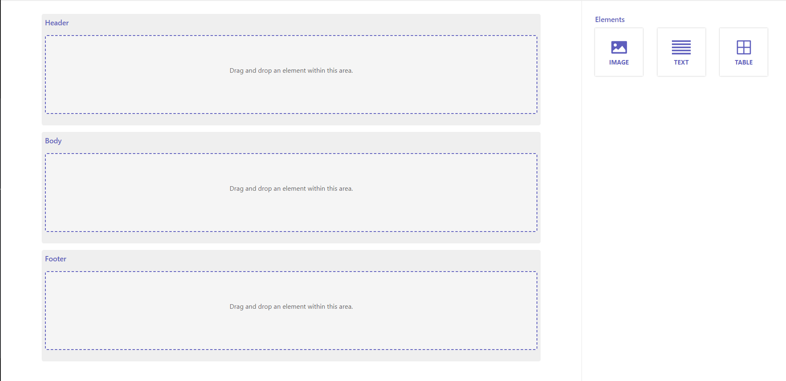
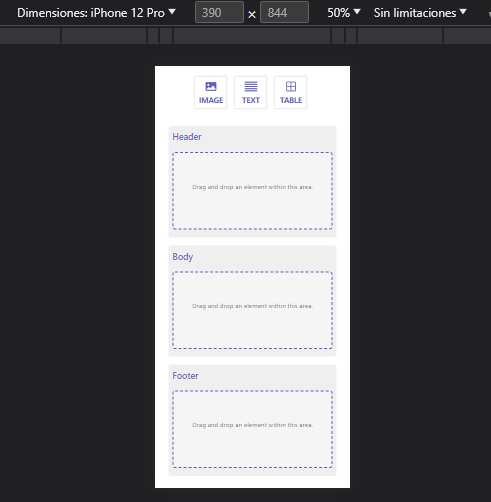

# PDF LAYOUT

## Getting Started

Mini app for drag and drop of elements to different areas.

### Installation 

Install dependencies

```
npm install
```

Run in development mode

```
npm run dev
```
## Technologies Used

- **React**: The project is built using React due to its component-based architecture, which enhances code reusability and scalability.
- **react-dnd**: This library is employed to manage draggable and droppable elements and areas, with custom modifications to suit the project's specifications.
- **toastify**: Used for displaying notifications, with customized behavior through custom functions.

## Possible Implementations

UX: It could be implemented alongside the interface designer, adding effects when including or moving an item within an area, dragging it outside, etc. The selected libraries have only been chosen to streamline the work a bit, but it would be possible to achieve everything using React components. For example, a component could be created to wrap the sidebar, showing or hiding items as needed. Additionally, for notifications, we could implement our own system without relying on libraries.

App Behavior: I have followed the test requirements, but other potential actions could include the ability to drag elements between areas to move them from one area to another or to remove an element from an area in order to incorporate it into a new area. Currently, the functionality is limited to dropping elements from the sidebar only. It would also be possible to delete an element by dragging it outside the area.

Testing: It's worth emphasizing the importance of conducting unit tests in this app to verify the functionality of each individual component, as well as integration tests to ensure that all components and the overall application function correctly.

Layout: For the site layout, I've used native CSS, although we could have also relied on libraries/frameworks/preprocessors like Tailwind, Material UI, Sass. For class naming, I've used BEM, which is particularly useful when working with Sass.

## Screenshots






## Contact

* **emaill:** anibaltorices@gmail.com
* **phone:** +34679854099
